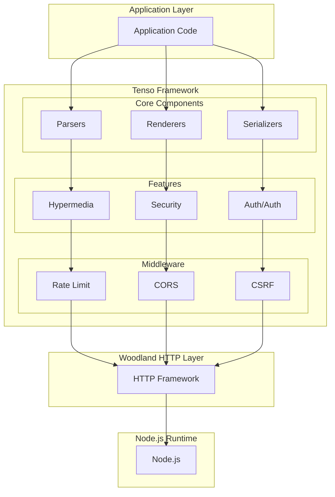
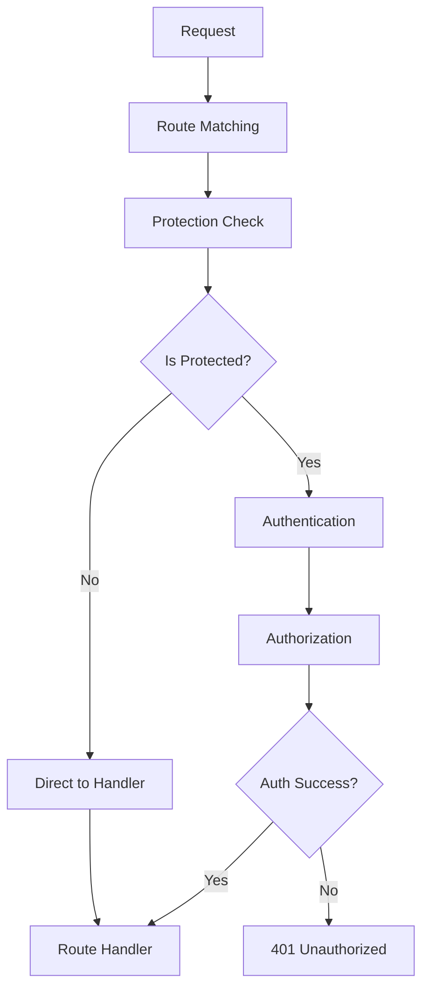
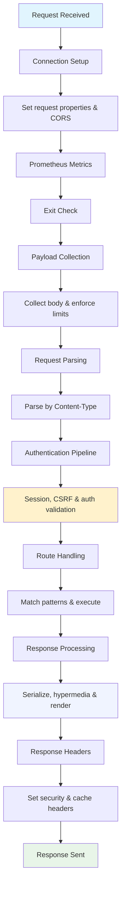

# Tenso Technical Overview

This document provides a comprehensive technical overview of the Tenso web framework, explaining its core functionality, authorization system, automatic response header management, hypermedia capabilities, and industry-standard features that make it a "ready to use" solution.

## Table of Contents

- [Architecture Overview](#architecture-overview)
- [Authorization & Permission System](#authorization--permission-system)
- [Automatic Response Header Decoration](#automatic-response-header-decoration)
- [Hypermedia & HATEOAS Support](#hypermedia--hateoas-support)
- [Content Negotiation & Serialization](#content-negotiation--serialization)
- [Ready-to-Use Feature Set](#ready-to-use-feature-set)
- [Request/Response Pipeline](#requestresponse-pipeline)
- [Security Framework](#security-framework)
- [Performance Features](#performance-features)

## Architecture Overview

Tenso is built on top of the [Woodland](https://github.com/avoidwork/woodland) HTTP framework and provides a comprehensive REST API solution with enterprise-grade features out of the box.

### Core Design Principles

1. **Configuration over Code**: Most features are enabled through simple configuration
2. **Middleware Pipeline**: Structured request processing with composable middleware
3. **Convention over Configuration**: Sensible defaults for immediate productivity
4. **Extensibility**: Plugin-based architecture for parsers, renderers, and serializers
5. **Industry Standards**: Built-in support for REST, HATEOAS, OpenAPI patterns

### Framework Stack



## Authorization & Permission System

Tenso provides a comprehensive authorization system that supports multiple authentication strategies and fine-grained permission control.

### Authentication Strategies

#### 1. **Basic Authentication**
```javascript
{
  auth: {
    basic: {
      enabled: true,
      list: ["admin:secret", "user:password"]
    },
    protect: ["/api/admin/*"]
  }
}
```

#### 2. **Bearer Token Authentication**
```javascript
{
  auth: {
    bearer: {
      enabled: true,
      tokens: ["abc123", "xyz789"]
    },
    protect: ["/api/private/*"]
  }
}
```

#### 3. **JWT Authentication**
```javascript
{
  auth: {
    jwt: {
      enabled: true,
      secretOrKey: "your-secret-key",
      algorithms: ["HS256"],
      audience: "your-audience",
      issuer: "your-issuer"
    },
    protect: ["/api/secure/*"]
  }
}
```

#### 4. **OAuth2 Authentication**
```javascript
{
  auth: {
    oauth2: {
      enabled: true,
      auth_url: "https://provider.com/oauth/authorize",
      token_url: "https://provider.com/oauth/token",
      client_id: "your-client-id",
      client_secret: "your-client-secret"
    },
    protect: ["/api/oauth/*"]
  }
}
```

### Permission Model

#### **Route Protection Patterns**
```javascript
{
  auth: {
    // Routes requiring authentication
    protect: [
      "/api/admin/*",        // Admin routes
      "/api/users/:id/edit", // User editing
      "/api/secure"          // Exact match
    ],
    
    // Routes bypassing authentication (DMZ)
    unprotect: [
      "/api/health",         // Health checks
      "/api/public/*",       // Public API
      "/auth/login"          // Login endpoint
    ]
  }
}
```

#### **Permission Checking Flow**


### Zuul Protection Middleware

The core authorization logic is handled by the `zuul` middleware:

```javascript
export function zuul(req, res, next) {
  const uri = req.url;
  let protect = false;

  // Check if route matches protection patterns
  if (req.unprotect === false) {
    for (const pattern of req.server.auth.protect) {
      if (pattern.test(uri)) {
        protect = true;
        break;
      }
    }
  }

  req.protect = protect;
  req.protectAsync = false;

  // Apply rate limiting and continue pipeline
  rate(req, res, (error) => {
    if (error) {
      res.error(error);
    } else if (protect) {
      next(); // Continue to authentication
    } else {
      req.exit(); // Skip auth pipeline
    }
  });
}
```

## Automatic Response Header Decoration

Tenso automatically manages response headers to ensure proper HTTP compliance and security.

### Automatic Header Management

#### **1. Content Type Headers**
```javascript
// Automatic content-type setting based on negotiation
res.header('Content-Type', 'application/json; charset=utf-8');

// Built-in content types supported:
// - application/json
// - application/xml  
// - application/yaml
// - text/csv
// - text/html
// - text/plain
```

#### **2. CORS Headers**
```javascript
// Automatic CORS header decoration
const header = `access-control-${req.method === 'OPTIONS' ? 'allow' : 'expose'}-headers`;
res.header(header, `${EXPOSE_HEADERS}${req.csrf ? ', x-csrf-token' : ''}${corsExpose}`);
```

#### **3. Security Headers**
```javascript
// Automatic cache control for protected routes
if (req.protect || req.csrf || req.private) {
  res.header('Cache-Control', 'private, no-cache, no-store, must-revalidate');
}

// CSRF token header (when enabled)
if (req.csrf) {
  const token = generateCsrfToken(req, res);
  res.header('x-csrf-token', token);
}
```

#### **4. Rate Limiting Headers**
```javascript
// Automatic rate limit headers
const rateHeaders = [
  'x-ratelimit-limit',
  'x-ratelimit-remaining', 
  'x-ratelimit-reset'
];

for (const [idx, header] of rateHeaders.entries()) {
  res.header(header, results[idx]);
}
```

#### **5. Allow Method Headers**
The framework automatically sets `Allow` headers based on registered routes:

```javascript
// In HTML renderer - shows available methods
.replace(TEMPLATE_ALLOW, headers.allow)
.replace(TEMPLATE_METHODS, explode(headers.allow)
  .filter(method => method !== '')
  .map(method => `<option value='${method.trim()}'>${method.trim()}</option>`)
  .join(''))
```

### Default Headers Configuration

```javascript
const defaultHeaders = {
  'content-type': 'application/json; charset=utf-8',
  'vary': 'accept, accept-encoding, accept-language, origin',
  'server': 'tenso/17.2.5',
  'x-powered-by': 'nodejs/v18.0.0, darwin/arm64'
};
```

## Hypermedia & HATEOAS Support

Tenso provides comprehensive HATEOAS (Hypermedia as the Engine of Application State) support through automatic link generation and response enhancement.

### Hypermedia Configuration

```javascript
{
  hypermedia: {
    enabled: true,  // Enable hypermedia processing
    header: true    // Include Link headers
  }
}
```

### Automatic Link Generation

#### **1. Collection Links**
```javascript
// For array responses, automatically generate:
{
  "data": [...],
  "links": [
    {"uri": "/users", "rel": "collection"},
    {"uri": "/users?page=1", "rel": "first"},
    {"uri": "/users?page=2", "rel": "next"},
    {"uri": "/users?page=10", "rel": "last"}
  ]
}
```

#### **2. Resource Links**
```javascript
// For object responses with ID patterns:
{
  "data": {
    "id": 123,
    "user_id": 456,
    "profile_url": "/profiles/abc"
  },
  "links": [
    {"uri": "/users/456", "rel": "related"},
    {"uri": "/profiles/abc", "rel": "related"}
  ]
}
```

#### **3. Pagination Links**
```javascript
// Automatic pagination for collections
GET /users?page=2&page_size=10

// Response includes:
"links": [
  {"uri": "/users?page=1&page_size=10", "rel": "first"},
  {"uri": "/users?page=1&page_size=10", "rel": "prev"},
  {"uri": "/users?page=3&page_size=10", "rel": "next"},
  {"uri": "/users?page=5&page_size=10", "rel": "last"}
]
```

### Link Header Generation

```javascript
// Automatic Link HTTP header
Link: </users>; rel="collection", </users?page=1>; rel="first", </users?page=3>; rel="next"
```

### Hypermedia Processing Pipeline

```javascript
// Response processing order:
1. serialize()   - Content negotiation and formatting
2. hypermedia()  - Link generation and pagination  
3. final()       - Custom post-processing hook
4. render()      - Final output formatting
```

### Smart Link Detection

The framework automatically detects linkable properties using patterns:

```javascript
// Detected ID patterns: /_(guid|uuid|id|uri|url)$/
const hypermediaPattern = /(([a-z]+(_)?)?ids?|urls?|uris?)$/i;

// Examples:
"user_id": 123        → "/users/123"
"profile_url": "..."  → "..."
"category_ids": [1,2] → "/categories/1", "/categories/2"
```

## Content Negotiation & Serialization

Tenso provides sophisticated content negotiation and serialization capabilities.

### Content Negotiation Flow

```javascript
// 1. Determine accepted format
const accepts = explode(
  req.parsed.searchParams.get('format') ||  // URL parameter
  req.headers.accept ||                      // Accept header
  res.getHeader('content-type') ||          // Current content-type
  req.server.mimeType                       // Default format
);

// 2. Find matching serializer
for (const mimetype of accepts) {
  if (serializers.has(mimetype)) {
    format = mimetype;
    break;
  }
}

// 3. Apply serializer
const serializer = serializers.get(format);
const result = serializer(data, error, statusCode, includeStack);
```

### Built-in Serializers

#### **1. Custom Serializer** (JSON, XML, YAML, etc.)
```javascript
function custom(data, error, status = 200, stack = false) {
  return {
    data: data,
    error: error ? (stack ? error.stack : error.message) : null,
    links: [],
    status: status
  };
}
```

#### **2. Plain Serializer** (Text, CSV)
```javascript
function plain(data, error, status = 200, stack = false) {
  if (Array.isArray(data)) {
    return data.map(item => plain(item)).join(',');
  }
  return data.toString();
}
```

### Renderer System

#### **JSON Renderer**
```javascript
function json(req, res, data) {
  return JSON.stringify(data, null, indent(req.headers.accept, req.server.jsonIndent));
}
```

#### **XML Renderer**
```javascript
function xml(req, res, data) {
  const builder = new XMLBuilder({
    processEntities: true,
    format: true,
    arrayNodeName: Array.isArray(data) ? 'item' : undefined
  });
  return `<?xml version="1.0" encoding="UTF-8"?>\n${builder.build({o: data})}`;
}
```

#### **HTML Renderer**
```javascript
function html(req, res, data, template) {
  return template
    .replace('{{title}}', req.server.title)
    .replace('{{body}}', sanitize(JSON.stringify(data, null, 2)))
    .replace('{{headers}}', renderHeaders(res.getHeaders()))
    .replace('{{allow}}', headers.allow)
    .replace('{{csrf}}', headers['x-csrf-token'] || '');
}
```

## Ready-to-Use Feature Set

Tenso provides a comprehensive set of enterprise-ready features that require minimal configuration.

### 1. **Security Features**

#### **CSRF Protection**
```javascript
// Automatic CSRF token generation and validation
{
  security: {
    csrf: true,
    key: "x-csrf-token",
    secret: "your-csrf-secret"
  }
}
```

#### **Security Headers (Helmet Integration)**
```javascript
{
  security: {
    csp: {
      directives: {
        defaultSrc: ["'self'"],
        scriptSrc: ["'self'", "'unsafe-inline'"]
      }
    },
    hsts: {
      maxAge: 31536000,
      includeSubDomains: true,
      preload: true
    },
    xssProtection: true,
    nosniff: true,
    xframe: "SAMEORIGIN"
  }
}
```

### 2. **Rate Limiting**
```javascript
{
  rate: {
    enabled: true,
    limit: 1000,           // Requests per window
    reset: 3600,           // Window in seconds
    status: 429,           // HTTP status for exceeded limits
    message: "Too many requests",
    override: (req, rate) => {
      // Custom rate limiting logic
      if (req.user?.premium) {
        rate.limit *= 10;   // 10x limit for premium users
      }
      return rate;
    }
  }
}
```

### 3. **Session Management**
```javascript
{
  session: {
    store: "redis",        // or "memory"
    redis: {
      host: "localhost",
      port: 6379
    },
    cookie: {
      httpOnly: true,
      secure: true,
      sameSite: "strict"
    },
    rolling: true,
    maxAge: 3600000       // 1 hour
  }
}
```

### 4. **Logging & Monitoring**
```javascript
{
  logging: {
    enabled: true,
    level: "debug",
    format: "%h %l %u %t \"%r\" %>s %b",
    stack: true           // Include stack traces
  },
  
  prometheus: {
    enabled: true,
    metrics: {
      includeMethod: true,
      includePath: true, 
      includeStatusCode: true,
      buckets: [0.001, 0.01, 0.1, 1, 5, 10],
      customLabels: {
        service: "api",
        version: "1.0.0"
      }
    }
  }
}
```

### 5. **File Serving & Static Assets**
```javascript
{
  webroot: {
    root: "/path/to/static/files",
    static: "/assets",     // URL prefix
    template: "custom.html" // Custom HTML template
  },
  autoindex: true          // Directory browsing
}
```

### 6. **CORS Configuration**
```javascript
{
  origins: ["https://app.example.com", "https://admin.example.com"],
  corsExpose: "x-total-count, x-page-count"
}
```

## Request/Response Pipeline

### Complete Request Flow



### Response Processing Detail

```javascript
// Core response pipeline in onSend
this.onSend = (req, res, body, status = 200, headers) => {
  // Set response headers
  this.headers(req, res);
  res.statusCode = status;

  // Skip processing for specific status codes or streams
  if (status !== 204 && status !== 304 && typeof body?.on !== 'function') {
    // Process through pipeline
    for (const fn of [serialize, hypermedia, this.final, this.render]) {
      body = fn(req, res, body);
    }
  }

  return [body, status, headers];
};
```

## Security Framework

### Multi-Layer Security Approach

#### **1. Transport Security**
- Automatic HTTPS support
- HSTS headers
- Secure cookie settings

#### **2. Authentication Security**
- Multiple auth strategies
- Random authentication delays (timing attack prevention)
- Session fixation protection

#### **3. Request Security**
- CSRF token validation
- Request size limiting
- Rate limiting per IP/session/token

#### **4. Response Security**
- Security headers via Helmet
- Content Security Policy
- XSS protection
- MIME type sniffing prevention

#### **5. Data Security**
- Automatic input sanitization
- SQL injection prevention via parameterized queries
- XSS prevention in output

### Security Configuration Example

```javascript
const secureConfig = {
  // SSL/TLS
  ssl: {
    cert: "/path/to/cert.pem",
    key: "/path/to/key.pem"
  },
  
  // Authentication
  auth: {
    basic: { enabled: true, list: ["admin:secure-password"] },
    delay: 1000,  // 1 second delay for auth attempts
    protect: ["/admin/*", "/api/private/*"]
  },
  
  // Security headers
  security: {
    csrf: true,
    csp: {
      directives: {
        defaultSrc: ["'self'"],
        scriptSrc: ["'self'"],
        styleSrc: ["'self'", "'unsafe-inline'"],
        imgSrc: ["'self'", "data:", "https:"]
      }
    },
    hsts: {
      maxAge: 31536000,
      includeSubDomains: true,
      preload: true
    }
  },
  
  // Rate limiting
  rate: {
    enabled: true,
    limit: 100,
    reset: 3600
  },
  
  // Request limits
  maxBytes: 1048576  // 1MB
};
```

## Performance Features

### 1. **Efficient Middleware Pipeline**
- Early exit for unprotected routes
- Conditional middleware execution
- Memoized expensive operations

### 2. **Content Caching**
```javascript
{
  cacheSize: 1000,      // LRU cache size
  cacheTTL: 300000,     // 5 minute TTL
  etags: true           // ETag generation
}
```

### 3. **Response Optimization**
- Gzip compression support
- Conditional requests (If-None-Match)
- Streaming responses for large data

### 4. **Database Integration**
- Connection pooling ready
- Query result caching
- Pagination support

### 5. **Monitoring & Metrics**
- Built-in Prometheus metrics
- Request/response timing
- Error tracking
- Custom metrics support

---

## Conclusion

Tenso provides a complete, production-ready REST API framework that eliminates the need to integrate multiple libraries and configure complex middleware stacks. Its "ready to use" philosophy means developers can focus on business logic while the framework handles:

- **Security**: Authentication, authorization, CSRF, security headers
- **Performance**: Caching, compression, efficient middleware
- **Standards Compliance**: REST, HATEOAS, HTTP specifications
- **Monitoring**: Logging, metrics, health checks
- **Content Management**: Parsing, serialization, content negotiation

This comprehensive feature set, combined with sensible defaults and extensive configurability, makes Tenso an ideal choice for building robust, scalable REST APIs with minimal setup time and maximum functionality. 
